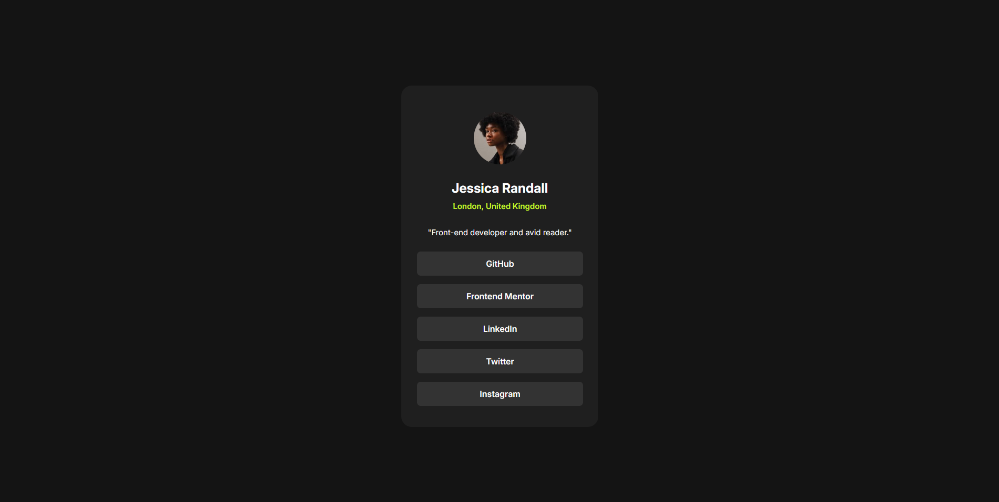
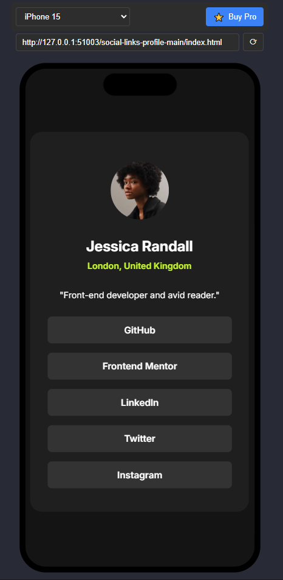

# Social links profile

# Frontend Mentor - Social links profile

This is a solution to the [Social links profile](https://www.frontendmentor.io/challenges/social-links-profile-UG32l9m6dQ). Frontend Mentor challenges help you improve your coding skills by building realistic projects. 

## Table of contents

- [Overview](#overview)
  - [Screenshot](#screenshot)
  - [Links](#links)
- [My process](#my-process)
  - [Built with](#built-with)
  - [What I learned](#what-i-learned)
  - [Continued development](#continued-development)
  - [Useful resources](#useful-resources)
- [Author](#author)


## Overview

### Screenshot

-PC screenshot :



-Phone screenshot:



-Active States:


### Links

- Solution URL: (https://shahriartbc.github.io/Social_links_profile/)

## My process

### Built with

- Semantic HTML5 markup
- CSS custom properties
- Use Some Tag


### What I learned

For me it was very dificult to choose the right properties in css to get the body and the .card to work and be seen as the style guide declared.

At the end, i believe i did a good job with the things that i used.
Always open to any comments  

```css
body{
  background-color: var(--greyC);
  font-family: "Inter", sans-serif;
  display: flex;
  justify-content: center;
  align-items: center;
}

.main{
  background-color: var(--greyB);
  width: 375px;
  height: 650px;
  margin: 100px auto;
  border-radius: 20px;
  display: flex;
  justify-content: center;
  
}


img{
  width: 100px;
  height: 100px;
  margin-top: 50px ;
  border-radius: 50%;
  position: absolute;
}


.aDiv{
  color: var(--white);
  margin-top: 180px;
  font-size: 25px;
  font-weight:700;
  position: absolute;
}

.bDiv{
  color: var(--green);
  margin-top: 220px;
  font-size: 15px;
  font-weight:600;
  position: absolute;
}

.cDiv{
  color: var(--white);
  margin-top: 260px;
  font-size: 15px;
  font-weight:400;
  position: absolute;
  padding: 10px;
}

li{
  width: 200px;
  height: 300px;
  margin-left: -115px;
  list-style: none;
  color: var(--white);
  margin-top: 300px;
 
}

ul{
  width: 300px;
  height: 30px;
  background-color: var(--greyA);
  padding: 8px;
  display: flex;
  justify-content: center;
  align-items: center;
  font-weight: 600;
  border-radius: 7px;
  cursor: pointer;
  
}

li ul:hover{
background-color: var(--green);
color: var(--greyC) ;
transition: 0.8s;
}
```

### Continued development
*****************

## Author
- Frontend Mentor - [@sharierahmed11](https://www.frontendmentor.io/profile/sharierahmed11)
